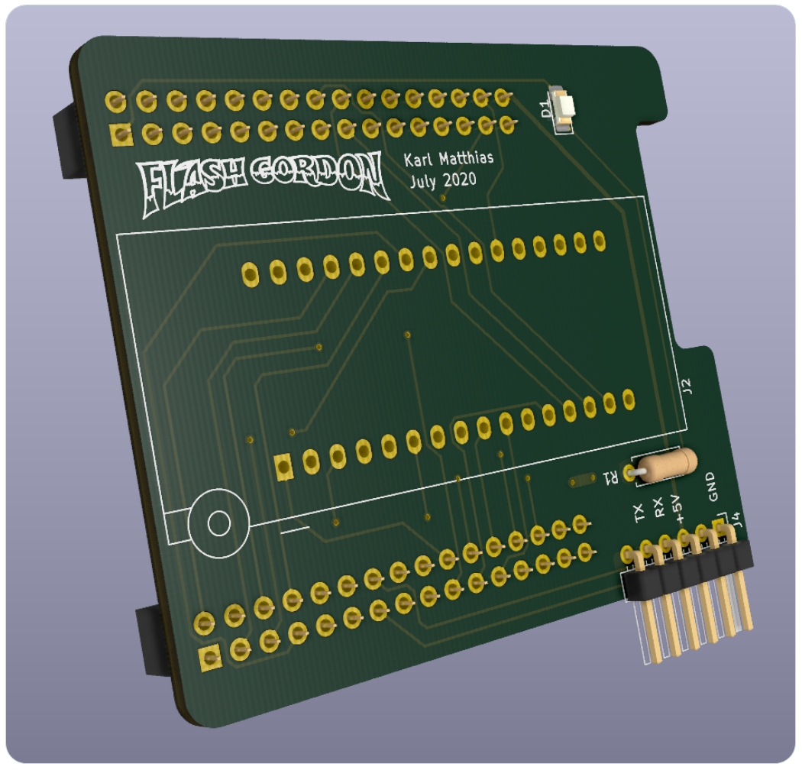

Flash Gordon - Flash Burner
===========================

This is the mcu-side code for the Flash Gordon flash burner that I designed and
built as a shield for a common ATmega128a break-out board. It interacts with
the host computer over serial and can upload, dump, chip erase, and sector
erase 32-pin parallel flash chips such as:

* SST39SF010A
* SST39SF020A
* SST39SF040
* Am29F010B
* Am29F020B
* Am29F040B
* ... other chips with the same, common pinout

The client-side software that interacts with this [is avilable in another
repo](https://github.com/relistan/flash-gordon-cli).

It is possible to use this with a serial terminal and without the client
software as long as you can provide properly formatted Intel Hex files using
the custom (very basic) serial protocol.

Hardware Required
-----------------



**You need the board!** Or at least a bread board wired up to work like one.
The schematic is not complicated, but it is a lot of wires and _very_ fiddly to
get right on a bread board. I does work, though, it's how I designed and
prototyped the board. [You can find a PDF of the schematic
here](./images/FlashGordonSchematic.pdf).

You **also need a 5V FTDI serial adapter**. These are available for any number
of sources for pretty little money. Many embedded hobbyists already have one. I
have the official FTDI one and it works perfectly. Note that the pinout on the
connector is the same as the official cable. The board draws power from the
FTDI cable and uses that to power both the LEDs and the flash chip.

Installing
----------

This was written in the Arduino development environment version 1.8.12 and
should work in that environment or newer.

### Clock Rate, Fuses

It expects the AVR to be runnning at 8mhz. I had to set the fuses properly on
my break-out boards since they were shipped using the internal 1Mhz oscillator
instead of the provided 8mhz crystal. I used a cheap USBasp programmer on the
ISP port of the ATmega128a breakout to program the chip.

The following `avrdude` command will set the fuses correctly:
```
avrdude -D -p m128 -c usbasp \
	-U lfuse:w:0xEF:m \
	-U hfuse:w:0x99:m \
	-U efuse:w:0xFF:m \
	-U lock:w:0xFF:m
```

### MegaCore

The ATmega128a is not natively supported by the Arduino development environment
but it _does_ have full support via the [MegaCore
project](https://github.com/MCUdude/MegaCore).  You must install that first in
order for the Arduino environment to work properly.  You may also want to
install the bootloader via the Arduino dropdown menu once MegaCore is
installed. This is not required if you will program this software via the
USBasp or another programmer.
